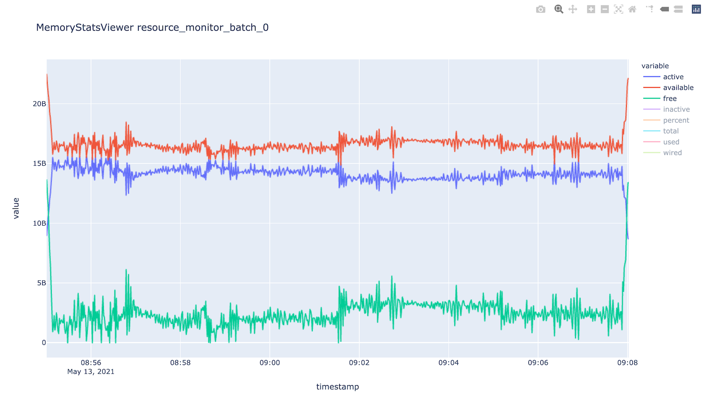

********
Tutorial
********

This page describes how to use the JADE package to create, modify, and run
jobs locally or on an HPC.

CLI Commands
============
All CLI commands documented in this page have a hierarchical nature. There are
group commands followed by subcommands. You can enter ``--help`` at any level.
For example:

.. code-block:: bash

    $ jade --help
    $ jade config --help
    $ jade config hpc --help

HPC Configuration
=================
This section only applies if you run your jobs on an HPC.

Change to a directory on the shared filesystem (such as /scratch on Eagle).
JADE uses the filesystem for internal synchronization.

HPC Parameters
--------------
You must define your HPC configuration in a settings file. Run this command
customized to your parameters.

.. code-block:: bash

    $ jade config hpc -a my-project -p short -t slurm -w "4:00:00" -c hpc.toml
    Created HPC config file hpc_config.toml

All parameters have defaults, and so you can run ``jade config hpc`` and then
edit the file afterwards.

The following parameters are optional when running on NREL's HPC (Eagle):

- ``partition``: If not specified then the HPC will decide the partition based
  on the wall time value (recommended unless you are using the ``debug``
  partition).
- ``mem``: If specified then the HPC will only
  provide nodes that have at least this amount of memory.  Refer to the HPC
  documentation for supported formats. On Eagle: "80GB", "150GB".
- ``tmp``: If specified then the HPC will only provide nodes that have at least this
  amount of storage space as scratch space. Refer to the HPC documentation for
  supported formats. On Eagle: "500GB", "2TB".

JADE was primarily designed to maximize use of compute node CPUs when running
jobs that only require a single node. Given that objective, the default value
of ``nodes`` is ``1``.

JADE also supports setting ``nodes``, ``ntasks``, and ``ntasks_per_node`` to
allow users to run multi-node jobs. Refer to the HPC documentation and ensure
each job is compatible with the settings. Note that each job will be run on
every node simultaneously.

Refer to :ref:`multi_node_job_strategy` for an example of how to use JADE's
multi-node feature.

Refer to :ref:`model_slurm_config` for a full list of parameters available
on NREL's Eagle HPC with SLURM.

JADE will name each HPC job with this format: ``<job_prefix>_batch_N`` where
``job_prefix`` is defined in ``hpc_config.toml`` and ``N`` is each batch index.
Customize ``job_prefix`` if you will be running multiple JADE batches and want
to be able to distinguish them.

Submission Groups
-----------------
If you need different parameters for different jobs then you can separately
define submission groups in the configuration. Refer to
:ref:`submission_group_strategy` for more information.

Lustre Filesystem
-----------------
If you are running on a Lustre filesystem then you should consider whether to
configure the Lustre stripe count. This can be beneficial if the the files you
create will be large or if many clients will be accessing them concurrently.

References:

- http://wiki.lustre.org/Configuring_Lustre_File_Striping
- https://www.nics.tennessee.edu/computing-resources/file-systems/lustre-striping-guide

.. note::

   This example Lustre filesystem command will only work if the directory is
   empty.

.. code-block:: bash

    $ lfs setstripe -c 16 <run-directory>

Configure Jobs
==============
Create a text file with a list of commands, one per line.

.. code-block:: bash

    $ cat commands.txt
    bash my_script.sh ARG1
    bash my_script.sh ARG2

.. warning:: Commands are not run through a shell, so you cannot use special
   shell characters. You can workaround this by putting your command in a
   shell script.

Job Commands
------------

.. code-block:: bash

    $ jade config create commands.txt -c config.json
    Created configuration with 2 jobs.
    Dumped configuration to config.json.

JADE created ``config.json`` with one definition per job. You can edit this
file to customize execution behavior.

.. note:: You can assign custom job names. This can make it easier to inspect results.

Refer to :ref:`model_generic_command_parameters` for a full list of
configurable parameters.

Add blocking jobs
-----------------
A common use case is to include a post-processing job as the last job, and then make all
other jobs blocked by it. Here is one way to do that. This assumes that there are 5 jobs
and the last job is the post-processing job.

.. note:: Job indexes are 0-based.

.. code-block:: bash

    $ jade config assign-blocked-by config.json 4 -o new-config.json

    # These alternatives are identical.
    $ jade config assign-blocked-by config.json 4 {0..3} -o new-config.json
    $ jade config assign-blocked-by config.json 4 0 1 2 3 -o new-config.json

Tip: Use this command to see the job indexes:

.. code-block:: bash

    $ jade config show config.json

Create a config programmatically
--------------------------------
If you are setting many custom parameters, it may be more convenient to create the
JADE configuration programmatically. An example is below. This will make the following customizations:

- Make a final post-processing job dependent on the other jobs.
- Set a custom name for each job.

.. code-block:: python

    from jade.extensions.generic_command import GenericCommandConfiguration, GenericCommandParameters

    config = GenericCommandConfiguration()
    base_cmd = "bash my_script.sh"
    regular_job_names = []
    for i in range(1, 4):
        cmd = base_cmd + " " + str(i)
        name = f"job_{i}"
        job = GenericCommandParameters(
            command=cmd,
            name=name,
        )
        config.add_job(job)
        regular_job_names.append(name)

    post_process_job = GenericCommandParameters(
        command="bash run_post_process.sh",
        name="post_process",
        blocked_by=regular_job_names,
        cancel_on_blocking_job_failure=True,
    )
    config.add_job(post_process_job)
    config_file = "config.json"
    config.dump(config_file, indent=2)

Here is the result::

    $ jade config show config.json
    Num jobs: 4
    +-------+--------------+--------------------------+------------------------+
    | index |     name     |         command          | blocked_by (job names) |
    +-------+--------------+--------------------------+------------------------+
    |   0   |    job_1     |   bash my_script.sh 1    |                        |
    |   1   |    job_2     |   bash my_script.sh 2    |                        |
    |   2   |    job_3     |   bash my_script.sh 3    |                        |
    |   3   | post_process | bash run_post_process.sh |  job_1, job_2, job_3   |
    +-------+--------------+--------------------------+------------------------+

Job Ordering
------------
Each job defines a ``blocked_by`` field. If you want to guarantee that job ID
2 doesn't run until job ID 1 completes then add that ID to the field.

If a job that is blocking another job fails then JADE will still run the
blocked job by default. This may not be what you want. You can optionally set
``cancel_on_blocking_job_failure`` to cause those blocked jobs to be canceled.

.. code:: python

    {
      "command": "<job_cli_command1>",
      "job_id": 1,
      "blocked_by": []
    },
    {
      "command": "<job_cli_command2>",
      "job_id": 2,
      "blocked_by": [1]
    },
    {
      "command": "<job_cli_command3>",
      "job_id": 3,
      "blocked_by": [1]
      "cancel_on_blocking_job_failure": false
    },
    {
      "command": "<job_cli_command4>",
      "job_id": 4,
      "blocked_by": [2, 3],
      "cancel_on_blocking_job_failure": true
    }

Show Job Summary
----------------
In order to view a summary of your jobs in a table:

.. code:: bash

    $ jade config show config.json

    Num jobs: 4
    +-------+------+----------------+---------------------------+
    | index | name |    command     |   blocked_by (job names)  |
    +-------+------+----------------+---------------------------+
    |   0   |  1   | julia run.jl 1 |                           |
    |   1   |  2   | julia run.jl 2 |            1              |
    |   2   |  3   | julia run.jl 3 |            1              |
    |   3   |  4   | julia run.jl 4 |           2, 3            |
    +-------+------+----------------+---------------------------+

CLI Execution
=============
Jade provides a CLI utility to start jobs.

submit-jobs
-----------
Start execution of jobs defined in a configuration file.  If executed on HPC
this will submit the jobs to the HPC queue. Otherwise, it will run the jobs
locally.

It's important to understand how JADE submits HPC jobs in order to optimize
your performance.  JADE divides the jobs created by the user into batches.  It
makes one HPC node submission for each batch. Once running on a node it runs in
parallel a number of worker processes equal to the number of CPUs on that node
(36 on Eagle).

Parameters to keep in mind:

- **Number of jobs**: Number of jobs created by the user.
- **Max nodes**: Max number of job submissions (batches) to run in parallel.
  Default is unbounded.
- **Per-node batch size**: Number of jobs to run on one node in one batch.
- **Allocation time**: How long it takes to acquire a node. Dependent on the
  HPC queue chosen and the priority given.
- **Average job runtime**: How long it takes a job to complete.
- **HPC config file**: Customized HPC parameters like walltime and partition
- **Time-based batching**: If jobs have variable runtimes then it is better to
  define those runtimes in the config file and then use the
  ``--time-based-batching`` flag to let JADE create variable-sized batches.
  Mutually exclusive with --per-node-batch-size.

If the jobs have a short duration and it takes a long time to acquire a
node then you may want to maximize the value of per_node_batch_size. Conversely,
if the time to acquire a node is short then you can lower per_node_batch_size in
order to run on more nodes in parallel.

Refer to :ref:`submission_strategies` for a description of how to handle
specific use cases.

Note that you can set different parameters for different batches if you define
submission groups. Refer to :ref:`submission_group_strategy` for more
information.

.. note:: You can enable ``--dry-run`` to check how the batches will be created
   without actually submitting any jobs.

Examples::

    # Use defaults.
    $ jade submit-jobs config.json

    # Specify options.
    $ jade submit-jobs config.json \
        --output=output \
        --per-node-batch-size=500 \
        --hpc-config=hpc_config.toml

Run ``jade submit-jobs --help`` to see all command options and defaults.

To aid with repeated runs you can pass these parameters in a config file.
Generate the defaults with

.. code-block:: bash

    $ jade config submitter-params

    Created submitter parameter file submitter_params.toml

And then pass this file to ``submit-jobs``

.. code-block:: bash

    $ jade submit-jobs config.json -s submitter_params.toml

.. note::

   By default HPC nodes are requested at normal priority. Set qos=high in
   hpc_config.toml to get faster allocations at twice the cost.

Output Directory
----------------
JADE stores all of its configuration information and log files in the output
directory specified by the ``submit-jobs`` command. JADE makes this directory
available to jobs in the environment variable ``JADE_RUNTIME_OUTPUT``. JADE
also makes each job name available in the environment variable
``JADE_JOB_NAME``.

.. note:: Job names are either job_id cast as a string or the optional name field in config.json.

This enables you to collect all job output files in a common location. JADE
automatically creates ``<output-dir>/job-outputs`` for this purpose.

Your job can store its output files in ``<output-dir>/job-outputs/<job-name>``

Suppose your actual job command accepts a parameter for an output directory like this:

.. code-block:: bash

    run_my_simulation -o my-output-folder --arg1 X --arg2 Y

Here is an example JADE wrapper script that forwards the runtime directory to your
program. It will also forward the rest of the arguments.

    #!/bin/bash
    run_my_simulation -o $JADE_RUNTIME_OUTPUT/job-outputs/$JADE_JOB_NAME $@

The command given to JADE would be ``bash jade_wrapper.sh --arg1 X --arg2 Y``.

Setup and teardown scripts
--------------------------
JADE supports the ability to run a setup script before running any jobs as well as a teardown
script after all jobs finish. Define the parameters ``setup_command`` and ``teardown_command``
in ``config.json``.

JADE will run the ``setup_command`` on the node where you run ``jade submit-jobs``, so be 
careful if this task will consume lots of computing resources. You may want to submit from
a debug node instead of a login node.

JADE will run the ``teardown_command`` on the last node to finish its jobs. It will run the
command regardless of whether jobs pass or fail. Be sure to account for impacts to the
per-node walltime timeout.

The following environment variable is available when these scripts are executed:

- ``JADE_RUNTIME_OUTPUT``: output directory passed to ``jade submit-jobs``

.. note:: In ``jade resubmit-jobs`` Jade will not rerun the setup command. It will re-run the teardown command.

Note that the output directory contains a copy of ``config.json`` in case you need to access
information from it.

When running on an HPC you might want to copy input files to each compute node
before running jobs and then upload output data afterwards. Define the parameters
``node_setup_command`` and ``node_teardown_command`` in ``config.json``. JADE will run those
commands before and after running each node's batch of jobs.

Note that the following environment variables are available when these scripts are executed:

- ``JADE_RUNTIME_OUTPUT``: This is the output directory passed to ``jade submit-jobs``
- ``JADE_SUBMISSION_GROUP``: This is the name of the submission group for the node.

.. note:: You can also set these parameters programmatically when constructing ``GenericCommandConfiguration``.

Example configurations
----------------------
Check out https://github.com/NREL/jade/tree/main/examples for examples using features discussed
above.

Job Execution
=============

HPC
---
The job submitter runs in a distributed fashion across the login node and all
compute nodes that get allocated.

1. User initiates execution by running ``jade submit-jobs`` on the login node.
2. JADE submits as many batches as possible and then exits. Jobs can be blocked
   by ordering requirements or the user-specified max-node limit.
3. HPC queueing system allocates a compute node for a batch of jobs and starts
   the JADE job runner process.
4. Both before and after running a batch of jobs the job runner will run
   ``jade try-submit-jobs``. If it finds newly-unblocked jobs then it will
   submit them in a new batch. This will occur on every allocated compute node.
5. When a submitter detects that all jobs are complete it will summarize
   results and mark the configuration as complete.

The JADE processes synchronize their activity with status files and a file lock
in the output directory.

Refer to :ref:`distributed_submission_workflow` for a diagram of this process.

Local
-----
JADE runs all jobs at the specified queue depth until they all complete.

Job Status
===========
While jobs are running you can check status with this command:

.. code-block:: bash

    $ jade show-status -o output

The status is updated when each compute node starts or completes its execution
of a batch, so this status may not be current.

Each job runner will log a message when it starts a job. Run this command to
follow all job starts:

.. code-block:: bash

   $ tail -f $(ls output/run_jobs_batch_*.log | grep -v events) | grep "Started job"

Each job runner will log completions to its own file, so you can see live job
completions with this command. Note that these files are cleared each time a
submitter processes them.

.. code-block:: bash

    $ tail -F output/results/results_batch_1.csv
    # This will follow all files that exist, not ones yet to be created.
    $ tail -F output/results/results_batch_*.csv

Check processed jobs in this file:

.. code-block:: bash

    # Find out how many have completed.
    $ wc -l output/processed_results.csv

    # Follow updates.
    $ tail -f output/processed_results.csv

Every submitter will log to the same file, so you can monitor submission status
with this command:

.. code-block:: bash

    $ tail -f output/submit-jobs.log

You can also trigger a full status update by manually trying to submit new
jobs.

.. code-block:: bash

    $ jade try-submit-jobs output
    $ jade show-status -o output

Canceling Jobs
==============
You can cancel all jobs running in a submission with this command:

.. code-block:: bash

    $ jade cancel-jobs output

Job Results
===========
Once execution is complete you can view the results of the jobs.

.. code-block:: bash

    $ jade show-results --output=output

Or only the ones that failed

.. code-block:: bash

    $ jade show-results --failed

JADE stores all results in a SQLite database. You can also use it to view results. Please refer to
:ref:`results_queries` for examples.

Failed or Missing Jobs
======================
If some jobs fail because of a walltime timeout or code/data error then you can
resubmit those specific jobs without re-running all the jobs that passed.

Jobs that timeout will be reported as missing.

.. note:: You can resubmit with different submission parameters, such as walltime,
    if you run ``jade config save-submission-groups output``,
    edit the resulting file, and then pass it to ``jade resubmit-jobs`` with ``-s <file>``

.. code-block:: bash

    $ jade resubmit-jobs --missing --failed output

.. note:: This command is currently not supported in local mode.

HPC Job information
===================

Hours Used
----------
Run this command after your jobs finish to see how many node hours you used.
Note that you can pass multiple output directories to accumulate jobs.

.. code-block:: bash

    $ jade hpc-jobs show-times output-dir*

    +------------+---------------------+---------------------+---------------------+----------+------------+-----------+--------+
    | hpc_job_id |         name        |        start        |         end         |  state   |  account   | partition |  qos   |
    +------------+---------------------+---------------------+---------------------+----------+------------+-----------+--------+
    |  9040969   |   P11U_CBA_batch_1  | 2022-04-15 18:58:17 | 2022-04-15 19:01:32 | complete | distcosts3 |   short   | normal |
    |  9040970   |   P11U_CBA_batch_2  | 2022-04-15 18:58:17 | 2022-04-15 19:02:04 | complete | distcosts3 |   short   | normal |
    |  9040971   |   P11U_CBA_batch_3  | 2022-04-15 18:58:17 | 2022-04-15 19:02:39 | complete | distcosts3 |   short   | normal |
    |  9040972   |   P11U_CBA_batch_4  | 2022-04-15 18:58:17 | 2022-04-15 19:01:17 | complete | distcosts3 |   short   | normal |
    |  9040973   |   P11U_CBA_batch_5  | 2022-04-15 18:58:17 | 2022-04-15 19:01:22 | complete | distcosts3 |   short   | normal |
    |  9041184   | P11U_CBA_pp_batch_1 | 2022-04-15 19:10:26 | 2022-04-15 19:15:13 | complete | distcosts3 |   short   | normal |
    +------------+---------------------+---------------------+---------------------+----------+------------+-----------+--------+

    Total duration = 1 day, 2:25:13
    Total hours = 26.42
    Total AUs = 79.26

Active Job IDs
--------------
You may want to run HPC-specific commands on job IDs to perform some action not directly supported by JADE.
You can run this command to see the active HPC job IDs (pending or running).

.. code-block:: bash

    $ jade hpc-jobs list-active-ids <output-dir>

Suppose you want to change the walltime value for each pending job. This example will work if your HPC
uses SLURM. (This will only work on pending jobs.)

.. code-block:: bash

    $ for x in `jade hpc-jobs list-active-ids <output-dir>`; do scontrol update jobid=$x TimeLimit="24:00:00"; done

Debugging
=========
By default JADE generates report files that summarize what happened. Refer to
``results.txt``, ``errors.txt``, ``stats.txt``, and ``stats_summary.json``.
The results file shows whether each job passed or failed.  The errors file
shows unhandled errors that JADE detected as well as known errors that it
parsed from log files.

Here are the log files that JADE generates. Open these to dig deeper.

- ``submit_jobs.log``: HPC-related information, such as the job ID and status
- ``run_jobs.log``: information about JADE starting and stopping jobs
- ``job-stdio``: Jade logs stdout and stderr from each job to this directory.
- ``job_output_<HPC job ID>.e``: The HPC logs stdout and stderr to this file.
  You will see output for HPC software and the operating system. Look here to
  debug unexpected crashes or hangs.

.. code-block:: bash

    $ find output -name "*.log" -o -name "*.e"
    output/J1__3__1.15__1.0__deployment1.dss/logs/deployment1.dss_simulation.log
    output/J1__3__1.15__1.0__deployment1.dss/pydss-project/Logs/pydss-project_deployment1.dss.log
    output/submit_jobs.log
    output/job_output_1151157.e

Python crashes will print ``Traceback`` to stderr, so that is a good string
to search for.

SLURM error strings:  ``srun``, ``slurmstepd``, ``DUE TO TIME LIMIT``

Useful grep commands

.. code-block:: bash
    
    # find error keywords in log and stderr files
    $ grep "WARNING\|ERROR" output/*log
    $ grep -n "srun\|slurmstepd\|Traceback" output/*.e
 
    # From the stats_summary, check max memory usage (in %) per node, in the form of sorted values.
    # This could inform the num_parallel_processes_per_node setting.
    $ grep "\bpercent\b" output/stats_summary.json | awk '{print $2}' | sort -n

Matching JADE jobs with HPC logs
--------------------------------
As mentioned above the HPC system captures stderr and stdout in ``<output-dir>/job_output_<HPC job ID>.e``
and ``<output-dir>/job_output_<HPC job ID>.o``. You may need to match JADE job IDs/names with these
files.

To help with this JADE records the HPC job ID for each job in ``results.txt`` (or ``jade show-results``).

You can also refer to :ref:`results_queries`. The ``result`` table includes this information.

Events
------
If your extension implements JADE structured log events then you may want to
view what events were logged.

JADE will also log any unhandled exceptions here.

.. code-block:: bash

    $ jade show-events
    $ jade show-events -c Error

Filtering jobs
--------------
You may want to debug a subset of the jobs.

Filter the first job into a new config file:

.. code-block:: bash

    $ jade config filter config.json 0 -o new_config.json

Filter ranges of indices of jobs into a new config file:

.. code-block:: bash

    $ jade config filter config.json {0..4} {10:14} 20 25 -o new_config.json

Deadlocks
---------
While it should be very rare, it is possible that JADE gets deadlocked and
stops submitting jobs. When a compute node finishes a batch of jobs it acquires
a file lock in order to update status and attempt to submit new jobs. This
should usually take at most a few seconds. If a walltime timeout occurs while
this lock is held and the JADE process is terminated then no other node will be
able to promote itself to submitter and jobs will be stuck.

We plan to add code to detect this condition in the future. If this occurs
you can fix it manually by deleting the lock file and restarting jobs. This is
safe if you know that no new jobs were submitted. It is unsafe if one or more
jobs were submitted but not recorded. Restarting the jobs could result in the
same jobs being run multiple times.

.. code-block:: bash

    $ rm <output-dir>/cluster_config.json.lock
    $ jade try-submit-jobs <output-dir>

If you would like to avoid the possibility of this happening then you can
pass ``--no-distributed-submitter`` to ``jade submit-jobs``. That will prevent
each compute node from updating status or looking for unblocked jobs to submit.
You will need to run the command ``jade try-submit-jobs`` yourself to do this.

If you enable periodic resource utilization collection in this mode, be aware
of the fact that once JADE detects that all jobs are complete it will
aggregate the stats and generate plots in that process. This is
resource-intensive and you may not want to run ``jade try-submit-jobs`` on the
login node.

.. _resource_monitoring:

Resource Monitoring
===================
In order to maximize the compute hours you consume it is critical to understand
the performance characteristics of your jobs. JADE helps with resorce
monitoring tools that run in the background on each node.

.. note:: Your HPC may already provide this type of information. If it makes
   the data easily accessible, you may want to disable all JADE monitoring.

Available monitors
------------------

- CPU utilization for each node (default = enabled)
- Memory utilization for each node (default = enabled)
- Process utilization by job (default = disabled)

  - CPU and memory utilization 
  - Include child processes (default = enabled)
  - Search for child processes recursively (default = disabled)

- Local disk utilization (default = disabled: Does not include Lustre filesystem.
- Network utilization (default = disabled)

Collection modes
----------------

1. ``aggregation``: Track average/min/max stats in memory on each node and
   generate a summary report at the end (default). Does not store data in files.

2. ``periodic``: Record stats in files on each node and generate a summary
   report and interactive HTML plots at the end. The reports include
   average/min/max stats. File sizes can be large with long runtimes.

Examples
--------
Monitoring is highly configurable. Due to the number of options, it is
recommended to create a ``submitter_params.json`` file and edit the settings
there.

You can specify most options in either ``jade submit-jobs`` or ``jade config
submitter-params``.

**Collect aggregated stats for CPU, memory, and per-job processes (including direct child processes)**

.. code-block:: bash

   $ jade config submitter-params -R aggregation -m cpu -m mem -m process

**Collect stats for CPU, memory, and per-job processes every 5 seconds**

.. code-block:: bash

   $ jade config submitter-params -R periodic -r 5 -m cpu -m mem -m process

**Collect per-job process information only for your job processes.**

This is more efficient than scanning for child processes. However, if your
job is a bash script that starts another process to do the real work, that work
won't be monitored.

.. code-block:: bash

   $ jade config submitter-params -R periodic -r 5 -m process

   # Edit the newly-created submitter_params.json such that include_child_processes=false

**Collect per-job process information for all processes started by your jobs, recursively.**

.. code-block:: bash

   $ jade config submitter-params -R periodic -r 5 -m process

   # Edit the newly-created submitter_params.json such that include_child_processes=true
   # and recurse_child_processes=true

**Disable all monitoring**

.. code-block:: bash

   $ jade config submitter-params -R none

Output files
------------
Both collection modes will generate ``<output-dir>/stats.txt`` and
``<output-dir>/stats_summary.json``.

If the ``periodic`` mode is enabled:

.. code-block:: bash

    $ tree output/stats
    output/stats
    ├── CpuStatsViewer__resource_monitor_batch_0.html
    ├── ProcessStatsViewer__cpu_percent.html
    ├── ProcessStatsViewer__rss_percent.html
    ├── DiskStatsViewer__resource_monitor_batch_0.html
    ├── MemoryStatsViewer__resource_monitor_batch_0.html
    └── NetworkStatsViewer__resource_monitor_batch_0.html

Use this CLI command to view textual tables after a run:

.. code-block:: bash

    $ jade stats show
    $ jade stats show cpu
    $ jade stats show mem
    $ jade stats show proc
    $ jade stats show --summary-only
    $ jade stats show --json-summary

Use the ``--json-summary`` option if you want to programmatically analyze the
average/minimum/maximum stats for each metric type.

The stats can also be provided as pandas.DataFrame objects. For example, here
is how to view CPU stats for the node that ran the first batch:

.. code-block:: python

   from jade.events import EventsSummary, EVENT_NAME_CPU_STATS
   from jade.resource_monitor import CpuStatsViewer

   summary = EventsSummary("output")
   viewer = CpuStatsViewer(summary)
   for name in viewer.iter_batch_names():
       cpu_df = viewer.get_dataframe(name)
       print(cpu_df.head())

The directory ``<output-dir>/events`` contains Parquet files for each stat. You can
also open these directly. Note that the ``source`` column designates the node/batch
that generated each row. For ``process`` dataframes, the job name is in the
``name`` column, and you should use it.

.. code-block:: python

   import pandas as pd

   # Print max memory usage in GiB by each job.
   df = pd.read_parquet("output/events/process_stats.parquet")
   for name, dfp in df.groupby(by="name"):
       print(name, dfp.rss.max() / (1024 * 1024 * 1024))

Standalone Resource Monitoring
------------------------------
The same resource monitoring functionality is available as a standalone script.
This can be useful to debug your application on your own system or in an interactive
session on a compute node. Here's how to do it:

.. code-block:: bash

    $ jade stats collect --interval=1 --output=job-stats
    # Run your application in a separate terminal.
    # Press Ctrl-c when your application is finished.
    $ jade stats plot --output=job-stats
    2021-05-12 16:59:48,367 - INFO [jade.resource_monitor resource_monitor.py:226] : Generated plot in job-stats/stats/CpuStatsViewer__ResourceMonitor.html
    2021-05-12 16:59:48,462 - INFO [jade.resource_monitor resource_monitor.py:226] : Generated plot in job-stats/stats/DiskStatsViewer__ResourceMonitor.html
    2021-05-12 16:59:48,541 - INFO [jade.resource_monitor resource_monitor.py:226] : Generated plot in job-stats/stats/MemoryStatsViewer__ResourceMonitor.html
    2021-05-12 16:59:48,629 - INFO [jade.resource_monitor resource_monitor.py:226] : Generated plot in job-stats/stats/NetworkStatsViewer__ResourceMonitor.html

Open the interactive plots in a browser.

You can also use the standalone tool to monitor currently running processes
by process ID or name. Refer to ``jade stats collect --help`` for more information.
